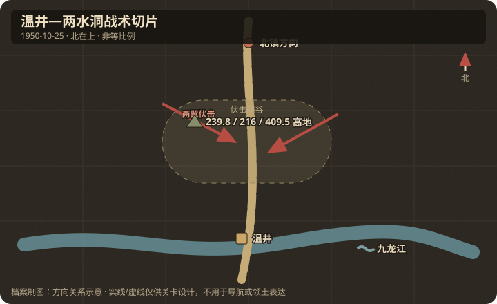

# 地理与卫星图对照

## 作战地域范围

- 今行政区划：朝鲜民主主义人民共和国平安北道云山郡温井邑一带（战史地名：温井、北镇、两水洞、丰下洞、富兴洞）。
- 大致经纬度范围：约 40.05°N–40.15°N，125.85°E–126.00°E（温井镇附近约 40.109°N, 125.896°E，待卫星复核）。
- 北向说明：游戏棋盘宜北为北镇/楚山方向，南为温井聚落，公路大致南北贯穿峡谷。

## 关键地物

| 地物 | 史实名称 | 今名/坐标 | 对战影响 | 棋盘建议 |
|------|----------|-----------|----------|----------|
| 聚落 | 温井 | 温井邑一带 | 夜间攻占目标；切断北进退路 | capture 点 |
| 公路 | 温井—北镇公路 | 峡谷公路 | 敌军车队行军轴 | 中央道路带 |
| 峡谷 | 两水洞千余米峡谷 | 两水洞 | 伏击主战场 | 两侧高地 + 谷底路 |
| 高地 | 239.8 / 216 / 409.5 | 公路北侧山脊 | 居高临下火力 | hill 地形 |
| 水系 | 九龙江 | 公路南侧/侧翼 | 限制展开、追歼方向 | 河/浅滩格 |

## 道路与水系

- 主公路：温井通往北镇（并向楚山方向延伸）。
- 桥梁/渡口：九龙江沿线浅滩与岸边为追歼通道。
- 河流走向：九龙江大致沿公路侧翼，制约敌军横向展开。

## 高地与阵地

| 编号/名称 | 位置 | 控守方（开局） | 备注 |
|-----------|------|----------------|------|
| 239.8 高地 | 富兴洞侧 | 志愿军设伏 | 354 团阵地 |
| 216 高地 | 丰下洞侧 | 志愿军设伏 | 拦头位置 |
| 409.5 高地 | 公路北侧 | 志愿军设伏 | 瞰制公路 |

## 附图

- 证据等级：公路、峡谷与三处高地为 A；现代精确坐标为 C，不用于单格定位。
- 制图约束：温井在伏击区南侧；玩家从公路两翼设伏，不从南端排队正攻。
