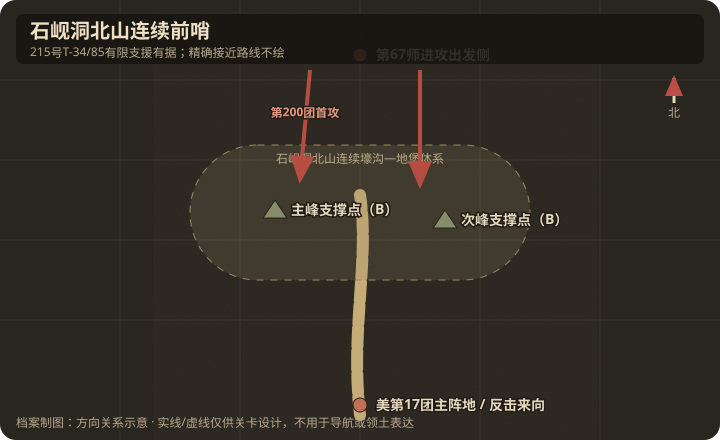

# 地理与卫星图对照

## 作战地域范围

- 今行政区划：朝鲜/韩边境铁原—涟川以北前哨带（石岘洞北山）。
- 大致范围：朔宁东北约 10 千米；现代精确经纬度目前只见于二次资料，列为 C 级，不用于单格定位。
- 北向说明：北为志愿军主防线；南为联合国军 MLR。

## 关键地物

| 地物 | 史实名称 | 今名/坐标 | 对战影响 | 棋盘建议 |
|------|----------|-----------|----------|----------|
| 前哨 | 猪排山 / 石岘洞北山 | 朔宁东北约10千米 | 主战场 | 连续山脊地图 |
| 主峰/次峰与堡群 | 官方战例未按游戏“东/西”命名 | 同一山脊 | capture / counterattack | 压缩为相连支撑点（B） |
| 壕沟网 | 沙袋地堡连壕 | 全山 | 减伤/近战 | trench tiles |
| 美军主阵地 | 334、346.6 高地 | 距前哨不足约500米 | 反击与火力支援背景 | 地图南缘/画外 |
| 坦克接近工程 | 3,000余米圆木路 | 精确路线未核 | 215号等坦克支援准备 | 只标“有限支援”，不画精确路 |

## 道路与水系

- 主公路：美军补给便道自南侧主抵抗线伸入；志愿军另修圆木路保障坦克进入出发阵地，确切走向未核。
- 桥梁/渡口：无；关键是山脊鞍部。
- 河流走向：周边冲沟，雨季泥泞。

## 高地与阵地

| 编号/名称 | 位置 | 控守方（开局） | 备注 |
|-----------|------|----------------|------|
| 主峰堡群 | 连续山脊主部 | 美军两个步兵连与一个火器连守备体系 | 第200团第6连首攻 |
| 次峰/相邻支撑点 | 同一山脊 | 美军 | 第201团后续夺回 |
| 334、346.6高地 | 前哨以南不足约500米 | 美第7师第17团主阵地 | 反击来源，通常只作画外压力 |

## 附图

- 证据等级：朔宁东北约10千米、334/346.6高地相对关系、连续工事与撤守结果为 A；东西支撑点划分、圆木路单格走向为 B/C。
- 制图约束：两个目标必须由连续壕沟相连，属于同一前哨；215号坦克可标有限支援，但不得虚构精确接近路线。
