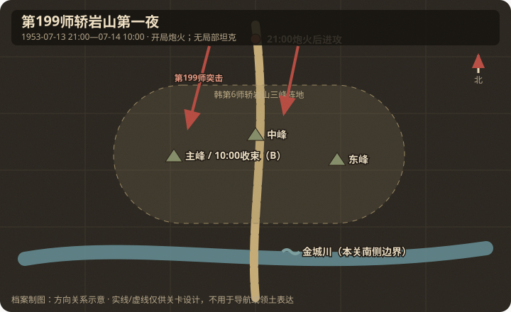

# 地理与卫星图对照

## 作战地域范围

- 今行政区划：朝鲜江原道金城郡东南、轿岩山至金城川北侧旧战线。
- 大致经纬度范围：金城一带；轿岩山精确现代点位待军图复核，不给出伪精确坐标。
- 北向说明：北为第199师进攻出发阵地；南为韩国陆军第6师轿岩山纵深与金城川。

## 关键地物

| 地物 | 史实名称 | 今名/坐标 | 对战影响 | 棋盘建议 |
|------|----------|-----------|----------|----------|
| 高地 | 轿岩山（西/中/东峰） | 金城川以北制高点 | 核心攻坚 | capture / 多格高地 |
| 河流 | 金城川 | 战线中部 | 突破后发展线 | stream |
| 地堡线 | 韩国陆军第6师轿岩山阵地 | 轿岩山三峰 | 需炮火准备 | bunkers |

## 道路与水系

- 主公路：金城—轿岩山方向局部道路；只表达中央集团接近轴与韩军阵地纵深。
- 桥梁/渡口：本关不设桥梁目标；金城川以南发展属于 14 日以后背景。
- 河流走向：金城川大致东西，位于本关南侧纵深/画外边界。

## 高地与阵地

| 编号/名称 | 位置 | 控守方（开局） | 备注 |
|-----------|------|----------------|------|
| 轿岩山主峰（西峰） | 第199师轴 | 韩第6师 | 14日10时前后攻克；结束目标 |
| 轿岩山中/东峰 | 主峰东 | 韩第6师 | 14日00:44前后先克；阶段目标 |

## 附图

- 证据等级：第67军第199师、韩第6师、轿岩山中/东峰先克与主峰后克为 A；14日10时结束点和三峰单格位置为 B。
- 制图约束：本关只画轿岩山西/中/东峰与南侧金城川边界；不画北汉江，不设桥梁或坦克任务。
