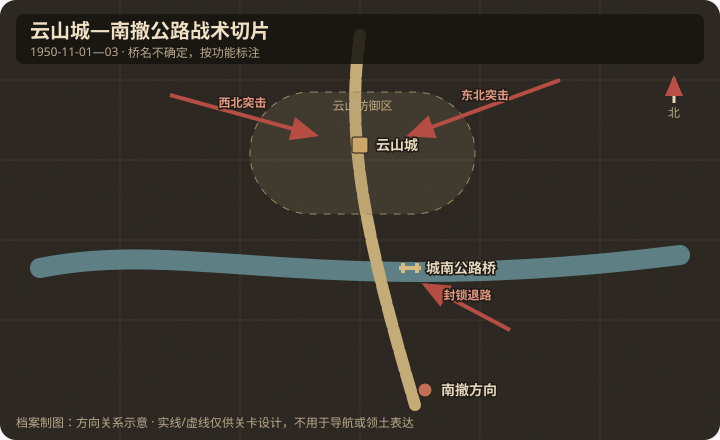

# 地理与卫星图对照

## 作战地域范围

- 今行政区划：朝鲜平安北道云山郡云山邑一带。
- 大致经纬度范围：约 39.95°N–40.05°N，125.75°E–125.95°E（云山邑约 39.98°N, 125.80°E，待卫星复核）。
- 北向说明：北为志愿军来向山地；南/东南为清川江水系与南撤公路。

## 关键地物

| 地物 | 史实名称 | 今名/坐标 | 对战影响 | 棋盘建议 |
|------|----------|-----------|----------|----------|
| 城镇 | 云山城 | 云山邑 | 主攻夺点 | capture |
| 桥梁 | 城南公路桥（专名未确认） | 城南/东南撤退路 | 突围瓶颈 | capture / choke |
| 公路 | 云山—清川江公路 | 南北向干道 | 坦克突围轴 | road |
| 水系 | 清川江支流 | 城周河谷 | 限制机动 | river |

## 道路与水系

- 主公路：自云山城向南/东南通往清川江渡口方向。
- 桥梁/渡口：官方战史支持城南撤退路上的关键桥，但未确认旧稿所用桥梁专名；游戏只用功能名“城南公路桥”。
- 河流走向：清川支流环绕/贴近城区，形成天然障碍。

## 高地与阵地

| 编号/名称 | 位置 | 控守方（开局） | 备注 |
|-----------|------|----------------|------|
| 城北高地 | 云山北侧 | 志愿军接近路 | 两翼压缩出发线 |
| 桥头阵地 | 南撤桥附近 | 联合国军 | 迫击炮/机枪常见配置 |

## 附图

- 证据等级：攻击方向、云山与南撤桥的战术作用为 A；桥梁专名与单格精确位置为 C。
- 制图约束：玩家从北、西北两翼接近；桥位于城南撤退轴，不与城镇左右并列。
