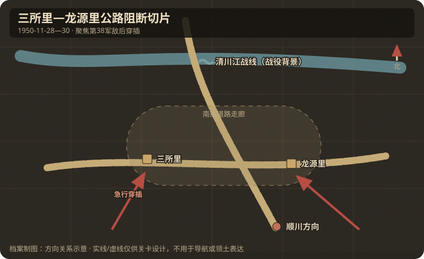

# 地理与卫星图对照

## 作战地域范围

- 今行政区划：朝鲜平安南道价川—顺川—军隅里公路走廊（战史：三所里、龙源里）。
- 大致经纬度范围：约 39.55°N–39.75°N，125.85°E–126.15°E（待卫星精确标注三所里/龙源里村点）。
- 北向说明：北为清川江与联合国军主阵地；南为顺川方向南撤出口。

## 关键地物

| 地物 | 史实名称 | 今名/坐标 | 对战影响 | 棋盘建议 |
|------|----------|-----------|----------|----------|
| 公路口 | 三所里 | 军隅里南公路节点 | 截断西侧南撤 | capture |
| 公路口 | 龙源里 | 相邻公路节点 | 截断东侧/平行南撤 | capture |
| 水系 | 清川江 | 北界大河 | 战役背景障碍 | 地图北缘标注 |
| 山脊 | 穿插山路 | 公路两侧山地 | 绕开正面火力 | 高地走廊 |

## 道路与水系

- 主公路：军隅里—顺川南撤干道（美第 9 军撤退轴）。
- 桥梁/渡口：清川江渡口在战役北段；本关焦点是江以南公路卡口。
- 河流走向：清川江大致东西向，作战在江南侧山地公路网。

## 高地与阵地

| 编号/名称 | 位置 | 控守方（开局） | 备注 |
|-----------|------|----------------|------|
| 公路两侧高地 | 三所里/龙源里旁 | 先到先得 | 阻击必须占高地 |
| 后卫阵地 | 公路北段 | 联合国军 | 掩护车队通过 |

## 附图

- 证据等级：三所里、顺川撤退路与敌后道路阻断为 A；两节点压进同一战术图为 B。
- 制图约束：清川江仅作战役背景；核心地形是横向撤退路与南北穿插路线。
