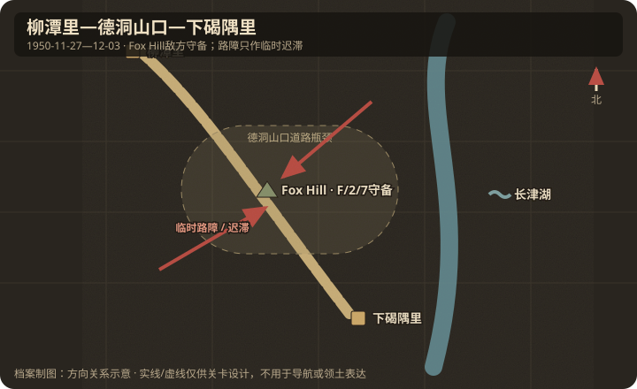

# 地理与卫星图对照

## 作战地域范围

- 今行政区划：朝鲜咸镜南道长津郡—赴战郡长津湖地区。
- 大致经纬度范围：约 40.35°N–40.55°N，127.10°E–127.40°E。
  - 下碣隅里（Hagaru-ri）约 40.38°N, 127.25°E
  - 柳潭里（Yudam-ni）约 40.48°N, 127.12°E
  - 死鹰岭（Toktong Pass）位于两者之间公路垭口
- 北向说明：湖西岸公路大致西北（柳潭里）—东南（下碣隅里）。

## 关键地物

| 地物 | 史实名称 | 今名/坐标 | 对战影响 | 棋盘建议 |
|------|----------|-----------|----------|----------|
| 高地 | Fox Hill（俯瞰德洞山口） | F 连阵地 | 瞰制主补给路；史实持续由 F/2/7 守住 | 敌方背景强点，不可 capture/hold |
| 道路瓶颈 | 德洞山口道路 | Toktong Pass MSR | 多次设障、清障与车队战斗 | 临时 delay / roadblock |
| 营地 | 下碣隅里 | Hagaru-ri | 南撤集结点 | 地图南/东标注 |
| 营地 | 柳潭里 | Yudam-ni | 陆战队出发地 | 地图北/西标注 |
| 水系 | 长津湖 | Changjin Reservoir | 限制绕行，极寒 | 大面积湖面 |
| 公路 | 唯一南北干道 | MSR | 装甲与车队必经 | road choke |

## 道路与水系

- 主公路：柳潭里—死鹰岭—下碣隅里—古土里—兴南。
- 桥梁/渡口：湖周桥梁/涵洞在冬季可能结冰，但仍是车辆瓶颈。
- 河流/湖：长津湖为主体；岸线陡峭，步行绕行成本高。

## 高地与阵地

| 编号/名称 | 位置 | 控守方 | 备注 |
|-----------|------|--------|------|
| Fox Hill | 德洞山口道路侧高地 | 美陆战 F/2/7 | 坚守至获援，不作为玩家夺点 |
| 临时路障带 | F 连高地下方主补给路 | 志愿军可短时控制 | 阻断后被清除；本关 delay |
| Funchilin Pass 等 | 更南段 | 突围后期 | 可作后续扩展 |

## 附图

- 证据等级：三地、湖西岸道路、F 连坚守 Fox Hill 为 A；多个临时路障合并为一处战术阻断带为 B。
- 制图约束：公路从西北到东南，湖在东侧；Fox Hill 标为敌方守备背景，玩家只在邻近道路短时断路并撤离。
