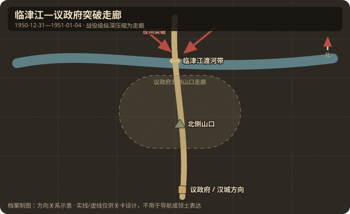

# 地理与卫星图对照

## 作战地域范围

- 今行政区划：韩国京畿道坡州—扬州—议政府一带（临津江南岸至汉城北廊）。
- 大致经纬度范围：约 37.70°N–37.95°N，126.75°E–127.10°E。
  - 议政府约 37.74°N, 127.05°E
  - 临津江渡口带约 37.89°N, 126.78°E 一带（多处渡口）
- 北向说明：北为三八线以北出发阵地；南为汉城方向。

## 关键地物

| 地物 | 史实名称 | 今名/坐标 | 对战影响 | 棋盘建议 |
|------|----------|-----------|----------|----------|
| 河流 | 临津江 | Imjin River | 主要障碍 | 横贯 river |
| 山口 | 议政府北侧山口 | 议政府北山地 | 纵深突破口 | capture |
| 公路站 | 汉城北廊公路节点 | 国道 3 号廊道 | 追击轴 | capture |
| 城镇 | 议政府 | Uijeongbu | 战役地标 | 标注 |

## 道路与水系

- 主公路：开城/涟川方向—议政府—汉城。
- 桥梁/渡口：临津江冬季渡口与残桥；夜渡为重点。
- 河流走向：临津江大致西北—东南，再转折。

## 高地与阵地

| 编号/名称 | 位置 | 控守方（开局） | 备注 |
|-----------|------|----------------|------|
| 江岸机枪阵地 | 渡口南岸 | 联合国军 | 渡河火力威胁 |
| 山口阵地 | 议政府北 | 联合国军 | 纵深收缩点 |

## 附图

- 证据等级：临津江、议政府及汉城北廊关系为 A；单一渡河带为 B。
- 制图约束：目标沿北→南方向前后排列，先渡河、再夺山口，不做左右对称双点。
