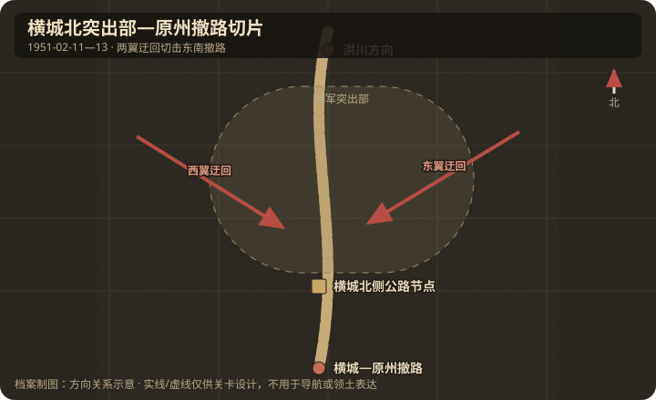

# 地理与卫星图对照

## 作战地域范围

- 今行政区划：大韩民国江原特别自治道横城郡北部。
- 大致经纬度范围：约 37.45°N–37.60°N，127.95°E–128.20°E（横城邑约 37.49°N, 128.00°E）。
- 北向说明：北为志愿军来向山地；南为横城邑，继续向南/东南通往原州。砥平里位于西侧战役背景，不进入本关目标轴。

## 关键地物

| 地物 | 史实名称 | 今名/坐标 | 对战影响 | 棋盘建议 |
|------|----------|-----------|----------|----------|
| 交通 | 横城北侧公路节点 | 横城北 | 割裂韩军 | capture |
| 撤路 | 横城—原州方向道路 | 南/东南廊道 | 韩军撤退主轴 | capture / cut-off |
| 山地 | 横城北山脊 | 起伏丘陵 | 迂回主通道 | hills |

## 道路与水系

- 主公路：洪川—横城—原州南北向轴；本关压缩横城北突出部至原州方向撤路。
- 桥梁/渡口：山区溪流多，冬季结冰，主要限制仍在山脊与隘路。
- 河流走向：支流河谷大致切割东西向山脊。

## 高地与阵地

| 编号/名称 | 位置 | 控守方（开局） | 备注 |
|-----------|------|----------------|------|
| 北侧公路高地群 | 横城北 | 韩军 | 夜间易被迂回；只用功能名 |
| 南撤公路警戒阵地 | 原州方向撤路 | 美军/韩军 | 交通掩护 |

## 附图

- 证据等级：突出部、公路与东南撤退方向为 A；具体“北站”名称为 C，已弃用。
- 制图约束：两翼山路包住中央突出部，主撤路向南/东南通往横城、原州；不得把西侧砥平里支路画成主目标。
