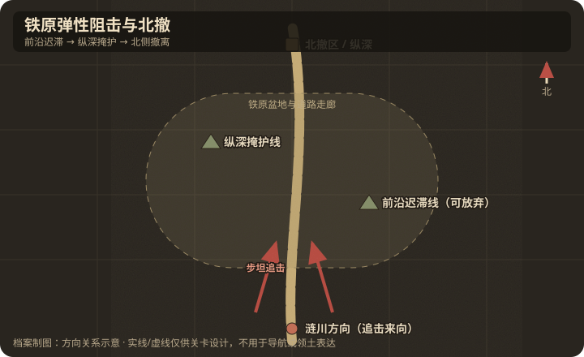

# 地理与卫星图对照

## 作战地域范围

- 今行政区划：韩国江原道铁原郡—京畿道涟川郡交界（战时空虚地带，部分今为非武装地带）。
- 大致经纬度范围：约 38.20°N–38.35°N，127.15°E–127.35°E（铁原邑约 38.25°N, 127.22°E）。
- 北向说明：北为志愿军纵深；南为联合国军追击轴。

## 关键地物

| 地物 | 史实名称 | 今名/坐标 | 对战影响 | 棋盘建议 |
|------|----------|-----------|----------|----------|
| 前沿高地 | 铁原走廊南侧高地群 | 南侧接敌线 | 早期迟滞 | delay，可放弃 |
| 纵深高地/公路口 | 铁原北侧纵深 | 北撤掩护节点 | 最后掩护与撤离 | final hold / evacuate |
| 平原 | 铁原盆地 | 开阔地 | 不利步兵白天停留 | 开阔减益 |
| 城镇 | 铁原 | Cheorwon | 交通枢纽地标 | 标注 |

## 道路与水系

- 主公路：涟川—铁原—金化/平康，为联合国军装甲追击主轴。
- 桥梁/渡口：盆地内小河，次要；关键是公路垭口与两侧高地。
- 河流走向：汉滩江等水系在涟川—铁原带切割地形。

## 高地与阵地

| 编号/名称 | 位置 | 控守方（开局） | 备注 |
|-----------|------|----------------|------|
| 前沿阻击线 | 地图南/中部 | 志愿军 | 延迟收益；完成阶段后可撤 |
| 纵深掩护线 | 地图北部 | 志愿军 | 终局掩护与撤离区 |
| 追击出发线 | 地图南缘 | 联合国军 | wave spawn |

## 附图

- 证据等级：联合国军南→北反攻、铁原交通走廊与志愿军掩护北撤为 A；两道阻击线的数量和单格位置为 B。
- 制图约束：敌军从南缘进入，玩家纵深与撤离区在北；前沿线不得与纵深线一起变成终局双 `hold`。
