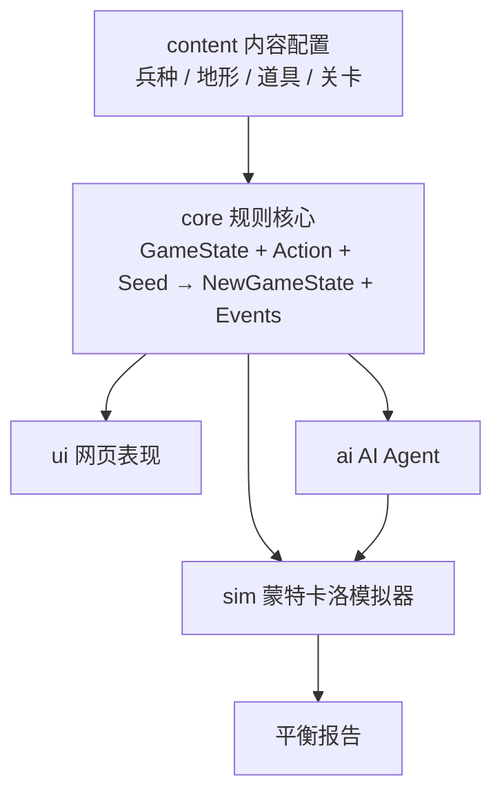

# 03 — 技术架构

## 四个部分



规则核心不依赖网页界面；界面、AI、模拟器共用同一份规则。

## 目录

```text
src/
├── core/           # 纯 TS，禁止引用 DOM
│   ├── types.ts        # GameState / Unit / Tile / Action / GameEvent
│   ├── rng.ts          # mulberry32 确定性流，状态存在 GameState 内
│   ├── grid.ts         # 网格、地形消耗、距离、可达域、射程
│   ├── combat.ts       # 伤害构成与反击
│   ├── items.ts        # 道具效果
│   ├── mission.ts      # 关卡装载、目标判定、回合推进
│   ├── enemyAi.ts      # 敌方脚本 AI（确定性）
│   ├── campaign.ts     # 跨关继承、永久减员、补充新兵
│   ├── actions.ts      # 合法动作枚举
│   └── engine.ts       # 唯一入口 applyAction()
├── content/        # 数据配置，逻辑层不写死数值
│   ├── units.ts  terrain.ts  items.ts  missions/*.ts  chapter.ts
├── ai/             # randomAgent / basicAgent / tacticalAgent
├── sim/            # Node CLI：批量跑种子 → JSON + Markdown 报告
└── ui/             # Canvas 棋盘 + DOM 面板，只渲染事件
```

## 确定性与重放

- 所有随机来自 `GameState.rng`（mulberry32 32 位状态），随状态一起推进。
- `applyAction(state, action)` 是纯函数，返回 `{ state, events }`，不修改入参。
- 一局的完整记录只需 `{ chapterId, seed, actions[] }`，即可精确重放。
- 测试断言：同 seed + 同动作序列 → 相同状态哈希。

## 工具链

- TypeScript（strict）+ Vite（网页）+ Vitest（测试）+ tsx（模拟器 CLI）。
- 构建产物 `dist/` 为纯静态目录，兼容后续对象存储托管。
- 无后端；存档、设置与回放使用 `localStorage`。

## 命令

```bash
npm run dev      # 本地开发
npm run build    # 构建静态产物
npm run test     # 规则核心与确定性测试
npm run sim      # 批量模拟 + 生成平衡报告
```
